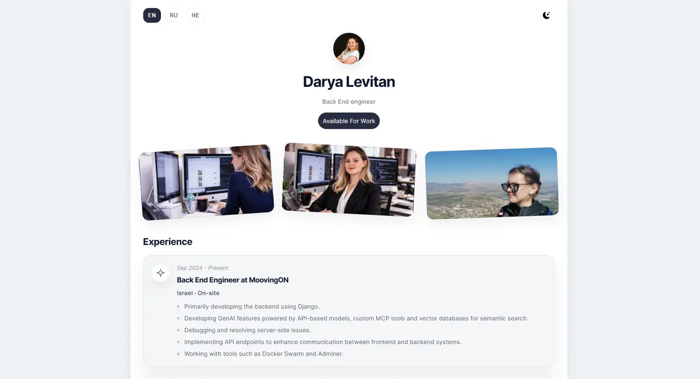

# Landfolio: portfolio site for Daria Levitan

A one-page portfolio for a back-end and AI engineer, built for a client and live at [daria-levitan.com](https://daria-levitan.com/). It covers experience, education, articles, side projects and recommendations, and has a contact form that sends email through EmailJS. The site switches between English, Russian and Hebrew (with a mirrored right-to-left layout) and between day and night themes, and it remembers the chosen language. All copy for the three languages lives in one content file (`src/content.js`), so the owner can update the site without touching components. Every push to `main` deploys through GitHub Actions: build, sync to Amazon S3, then a CloudFront cache invalidation, authenticating to AWS through OIDC with no stored access keys.

**Live:** [daria-levitan.com](https://daria-levitan.com/)

<p align="center">
  
</p>

**Stack:** Vue 3 (`<script setup>`) · Vite 7 · EmailJS · plain CSS · GitHub Actions · AWS S3 + CloudFront.

## Run locally

```bash
npm install
npm run dev        # http://localhost:5173
npm run build && npm run preview
```

For the contact form, set `VITE_EMAILJS_SERVICE_ID`, `VITE_EMAILJS_TEMPLATE_ID` and `VITE_EMAILJS_PUBLIC_KEY` in `.env`. The deploy workflow (`.github/workflows/deploy.yml`) expects the repository secrets `AWS_ROLE_ARN`, `AWS_REGION`, `S3_BUCKET` and `CLOUDFRONT_DISTRIBUTION_ID`.

## Author

Evgeny Nemchenko, full-stack developer: [bluecat.cc](https://bluecat.cc) · [LinkedIn](https://www.linkedin.com/in/evgeny-nemchenko) · [nevgeny90@gmail.com](mailto:nevgeny90@gmail.com) · [GitHub @Jony251](https://github.com/Jony251)
